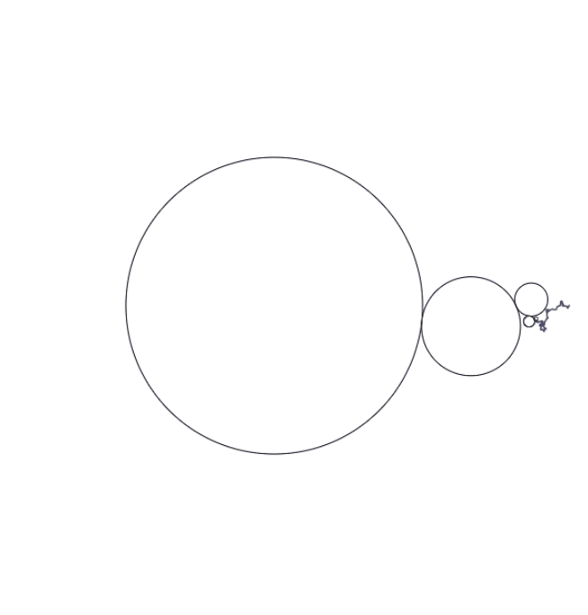

# Making Art with Mathematical Equations

## 1. Fractal Spirograph
A fractal created based on the rotations of `n` circles with a speed defined by `k^(n-1)` where `k` is a negative constant to flip the rotation of the circle for each new child circle. The size of each new circle is the parent's size divided by 3.

This fractal was generated using `k = -4` and `n = 100`.

Inspiration from: http://benice-equation.blogspot.com/2012/01/fractal-spirograph.html

Inspiration from: http://benice-equation.blogspot.com/2012/01/fractal-spirograph.html

## 2. Perlin noise
An animated one dimensional perlin noise graph and circle.

Inspiration from: https://rtouti.github.io/graphics/perlin-noise-algorithm
